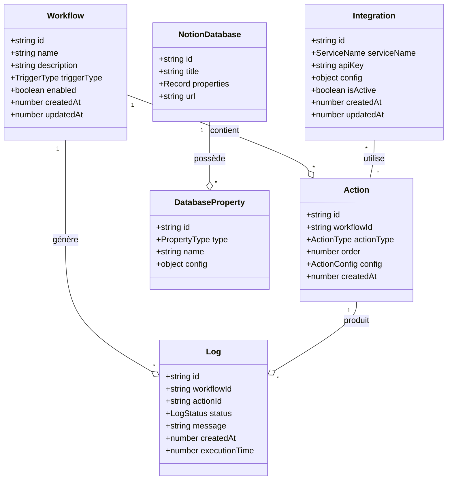
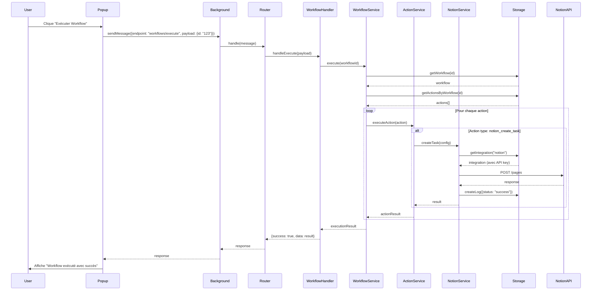
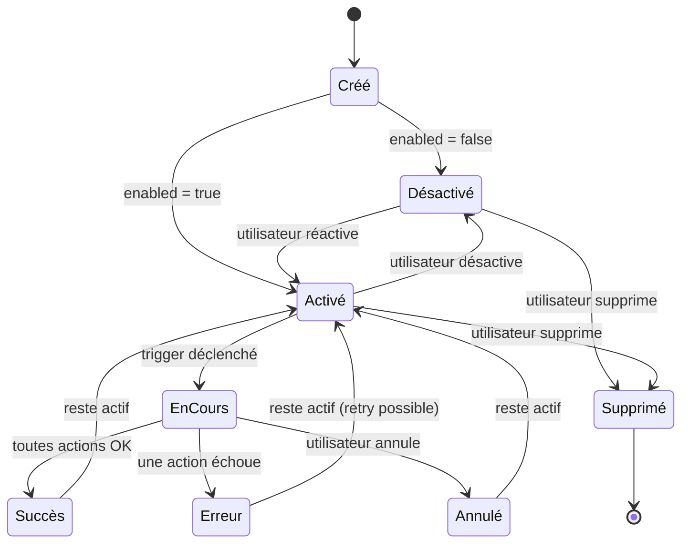
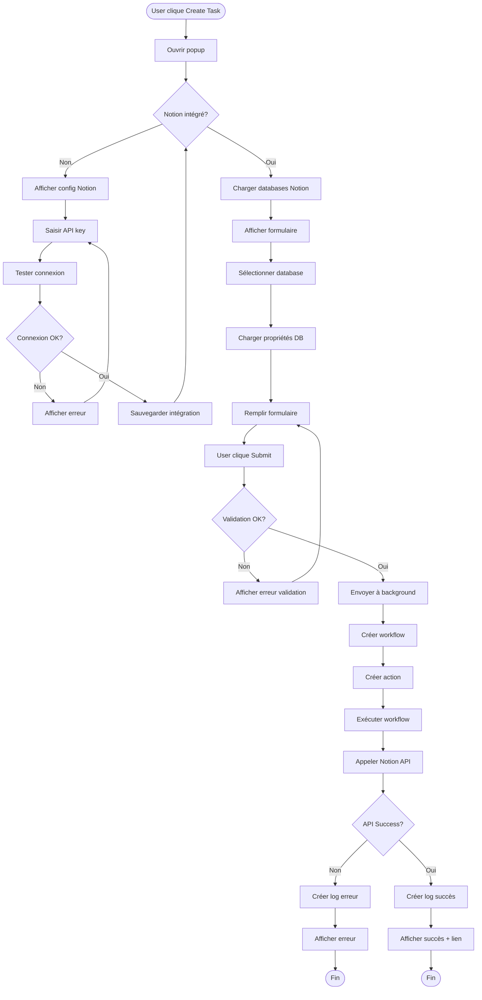

# 📊 Diagrammes UML - Extension Chrome Workflow

## 🎯 Vue d'Ensemble de l'Architecture

### Diagramme de Composants de Haut Niveau

```
┌─────────────────────────────────────────────────────────────┐
│                    CHROME EXTENSION                          │
├─────────────────────────────────────────────────────────────┤
│                                                               │
│  ┌─────────────┐                  ┌──────────────────────┐  │
│  │   Popup UI  │◄────messages────►│  Service Worker      │  │
│  │  (popup.ts) │                  │  (background.ts)     │  │
│  └─────────────┘                  └──────────────────────┘  │
│        │                                    │                │
│        │                                    │                │
│        │                          ┌─────────▼────────┐       │
│        │                          │     Router       │       │
│        │                          └─────────┬────────┘       │
│        │                                    │                │
│        │                          ┌─────────▼────────┐       │
│        │                          │    Handlers      │       │
│        │                          └─────────┬────────┘       │
│        │                                    │                │
│        │                          ┌─────────▼────────┐       │
│        │                          │    Services      │       │
│        │                          └─────────┬────────┘       │
│        │                                    │                │
│        └────────────────┐         ┌─────────▼────────┐       │
│                         └────────►│ StorageManager   │       │
│                                   └─────────┬────────┘       │
│                                             │                │
│                                   ┌─────────▼────────┐       │
│                                   │ Chrome Storage   │       │
│                                   │    (Local)       │       │
│                                   └──────────────────┘       │
│                                                               │
│                          ┌─────────────────────┐             │
│                          │   External APIs     │             │
│                          │   - Notion API      │             │
│                          │   - Slack API       │             │
│                          │   - ...             │             │
│                          └─────────────────────┘             │
└─────────────────────────────────────────────────────────────┘
```

---

## 📦 Diagramme de Classes - Modèle de Données

### Entités Principales



---

## 🔄 Diagramme de Séquence - Exécution d'un Workflow

### Scénario : L'utilisateur exécute un workflow manuellement



---

## 🏗️ Diagramme de Structure - Organisation des Dossiers

```
src/
├── background/
│   ├── background.ts ───────► Point d'entrée Service Worker
│   ├── router.ts ───────────► Route les messages vers handlers
│   ├── init.ts ─────────────► Initialisation de l'app
│   │
│   └── services/
│       ├── WorkflowService ─► Logique métier workflows
│       ├── ActionService ───► Exécution des actions
│       ├── NotionService ───► Intégration Notion API
│       └── IntegrationService ─► Gestion des API keys
│
├── api/
│   ├── endpoints.ts ────────► Définition centralisée endpoints
│   │
│   └── handlers/
│       ├── WorkflowHandler ─► CRUD workflows
│       ├── ActionHandler ───► CRUD actions
│       ├── IntegrationHandler ─► Gestion intégrations
│       └── TaskHandler ─────► Création tasks Notion
│
├── storage/
│   ├── StorageManager ──────► Abstraction chrome.storage
│   ├── migrations.ts ───────► Migrations de schéma
│   │
│   └── models/
│       ├── Workflow ────────► Model + méthodes
│       ├── Action ──────────► Model + validation
│       ├── Integration ─────► Model + encryption
│       └── Log ─────────────► Model + cleanup
│
├── popup/
│   ├── popup.ts ────────────► Script principal UI
│   ├── popup.html ──────────► Interface HTML
│   ├── popup.css ───────────► Styles
│   │
│   └── components/
│       ├── WorkflowList ────► Liste des workflows
│       ├── TaskCreator ─────► Formulaire création
│       └── IntegrationConfig ─► Config API keys
│
├── types/
│   ├── index.ts ────────────► Exports centralisés
│   ├── common.types.ts ─────► Types partagés
│   ├── api.types.ts ────────► Messages/réponses
│   ├── workflow.types.ts ───► Workflows & actions
│   ├── storage.types.ts ────► Structure storage
│   ├── notion.types.ts ─────► Types Notion API
│   ├── integration.types.ts ─► Intégrations
│   └── log.types.ts ────────► Logs d'exécution
│
└── utils/
    ├── logger.ts ───────────► Système de logs
    ├── validators.ts ───────► Validation données
    ├── constants.ts ────────► Constantes globales
    └── encryption.ts ───────► Encryption API keys
```

---

## 🔌 Diagramme de Communication - Message Passing

### Architecture de Communication

```
┌─────────────────────────────────────────────────────────┐
│                    MESSAGE FLOW                          │
└─────────────────────────────────────────────────────────┘

POPUP (UI)                              BACKGROUND (Service Worker)
─────────                               ────────────────────────────

┌──────────┐                            ┌──────────────────┐
│  User    │                            │   Listener       │
│  Action  │                            │  onMessage       │
└────┬─────┘                            └────────▲─────────┘
     │                                           │
     │ 1. Action utilisateur                    │
     ▼                                           │
┌──────────────────┐                             │
│ sendMessage()    │────────Message──────────────┘
├──────────────────┤         (async)
│ {                │
│  endpoint,       │                    ┌────────────────┐
│  payload,        │                    │    Router      │
│  metadata        │                    └────────┬───────┘
│ }                │                             │
└──────────────────┘                             │
     │                                           │ 2. Route vers handler
     │                                           ▼
     │                                  ┌─────────────────┐
     │                                  │    Handler      │
     │                                  └────────┬────────┘
     │                                           │
     │                                           │ 3. Appelle service
     │                                           ▼
     │                                  ┌─────────────────┐
     │                                  │    Service      │
     │                                  └────────┬────────┘
     │                                           │
     │                                           │ 4. Manipule données
     │                                           ▼
     │                                  ┌─────────────────┐
     │                                  │    Storage      │
     │                                  └────────┬────────┘
     │                                           │
     │◄────────Response───────────────────────────┘
     │         (async)                   5. Retour
     │
     │ {
     │  success: true,
     │  data: {...},
     │  error: null
     │ }
     │
     ▼
┌──────────────────┐
│  Update UI       │
└──────────────────┘
```

---

## 🎯 Diagramme d'État - Cycle de Vie d'un Workflow



---

## 🔐 Diagramme de Flux - Gestion des API Keys

```
┌─────────────────────────────────────────────────────────┐
│           GESTION SÉCURISÉE DES API KEYS                 │
└─────────────────────────────────────────────────────────┘

User saisit API key
       │
       ▼
┌─────────────────┐
│  Popup UI       │
│  Input field    │
└────────┬────────┘
         │
         │ chrome.runtime.sendMessage()
         │
         ▼
┌────────────────────────────┐
│  Background Service        │
│  IntegrationHandler        │
└────────┬───────────────────┘
         │
         │ validate()
         ▼
┌────────────────────────────┐
│  IntegrationService        │
│  testConnection()          │
└────────┬───────────────────┘
         │
         │ Test API key
         ▼
┌────────────────────────────┐
│  Notion API / External     │
│  GET /users/me             │
└────────┬───────────────────┘
         │
         │ Valid ✅
         ▼
┌────────────────────────────┐
│  EncryptionService         │
│  encrypt(apiKey)           │ (optionnel)
└────────┬───────────────────┘
         │
         │ Encrypted key
         ▼
┌────────────────────────────┐
│  StorageManager            │
│  chrome.storage.local.set()│
└────────────────────────────┘
         │
         │ Saved ✅
         ▼
┌────────────────────────────┐
│  Response to Popup         │
│  {success: true}           │
└────────────────────────────┘

═══════════════════════════════

Usage ultérieur :

NotionService needs API key
         │
         ▼
┌────────────────────────────┐
│  IntegrationService        │
│  getApiKey('notion')       │
└────────┬───────────────────┘
         │
         ▼
┌────────────────────────────┐
│  StorageManager            │
│  get('integrations')       │
└────────┬───────────────────┘
         │
         ▼
┌────────────────────────────┐
│  EncryptionService         │
│  decrypt(encryptedKey)     │ (si encrypted)
└────────┬───────────────────┘
         │
         │ Plain API key
         ▼
┌────────────────────────────┐
│  NotionService             │
│  Use in API calls          │
└────────────────────────────┘
```

---

## 📊 Diagramme Entité-Association - Modèle de Données

```
┌─────────────────────────────────────────────────────────┐
│              ENTITY RELATIONSHIP DIAGRAM                 │
└─────────────────────────────────────────────────────────┘

┌──────────────┐         ┌──────────────┐
│   Workflow   │         │  Integration │
├──────────────┤         ├──────────────┤
│ id           │         │ id           │
│ name         │         │ service_name │
│ description  │         │ api_key      │
│ trigger_type │         │ config       │
│ enabled      │         │ is_active    │
│ created_at   │         │ created_at   │
│ updated_at   │         │ updated_at   │
└──────┬───────┘         └──────────────┘
       │                        ▲
       │ 1                      │
       │                        │ N
       │ contient               │ utilise
       │                        │
       │ N                      │
       ▼                        │
┌──────────────┐                │
│    Action    │────────────────┘
├──────────────┤
│ id           │
│ workflow_id  │ (FK)
│ action_type  │
│ order        │
│ config       │
│ created_at   │
└──────┬───────┘
       │
       │ 1
       │
       │ génère
       │
       │ N
       ▼
┌──────────────┐
│     Log      │
├──────────────┤
│ id           │
│ workflow_id  │ (FK)
│ action_id    │ (FK)
│ status       │
│ message      │
│ created_at   │
│ execution_time│
└──────────────┘


Relations :
──────────
• Un Workflow contient N Actions (1:N)
• Une Action utilise N Integrations (N:N)
• Un Workflow génère N Logs (1:N)
• Une Action génère N Logs (1:N)
```

---

## 🚀 Diagramme de Déploiement - Structure Build

```
┌─────────────────────────────────────────────────────────┐
│                   BUILD PROCESS                          │
└─────────────────────────────────────────────────────────┘

SOURCE (src/)                           OUTPUT (dist/)
─────────────                           ──────────────

src/background/
  └── background.ts ──┐
                      │
src/popup/            │
  ├── popup.ts ───────┤
  └── popup.html ─────┤
                      │
src/types/            │
  └── *.ts ───────────┤
                      │         ┌─────────────┐
src/storage/          ├────────►│    VITE     │
  └── *.ts ───────────┤         │   Bundler   │
                      │         └──────┬──────┘
src/api/              │                │
  └── *.ts ───────────┤                │
                      │                │ Compile
src/utils/            │                │ & Bundle
  └── *.ts ───────────┘                │
                                       │
manifest.json ────────────────────────┤
                                       │
images/ ───────────────────────────────┤
                                       │
                                       ▼
                              ┌────────────────┐
                              │   dist/        │
                              ├────────────────┤
                              │ background.js  │
                              │ popup.js       │
                              │ popup.html     │
                              │ popup.css      │
                              │ manifest.json  │
                              │ images/        │
                              └────────┬───────┘
                                       │
                                       │ Load into
                                       ▼
                              ┌────────────────┐
                              │   Chrome       │
                              │  Extensions    │
                              └────────────────┘
```

---

## 🔄 Diagramme d'Activité - Création d'une Task Notion



---

## 📱 Diagramme d'Interface - Popup UI

```
┌────────────────────────────────────────────────┐
│  Chrome Workflow Extension           [x]       │
├────────────────────────────────────────────────┤
│                                                 │
│  ┌─────────────────────────────────────────┐  │
│  │  Workflows                      [+ New]  │  │
│  ├─────────────────────────────────────────┤  │
│  │                                          │  │
│  │  ☑ Quick Task Creation                  │  │
│  │     └─ Create Notion Task                │  │
│  │        ▶ Execute  ✎ Edit  🗑 Delete     │  │
│  │                                          │  │
│  │  ☐ Daily Summary                        │  │
│  │     └─ Create Notion Page                │  │
│  │        ▶ Execute  ✎ Edit  🗑 Delete     │  │
│  │                                          │  │
│  └─────────────────────────────────────────┘  │
│                                                 │
│  ┌─────────────────────────────────────────┐  │
│  │  Quick Actions                           │  │
│  ├─────────────────────────────────────────┤  │
│  │  [Create Task]  [Create Note]            │  │
│  └─────────────────────────────────────────┘  │
│                                                 │
│  ┌─────────────────────────────────────────┐  │
│  │  Integrations                    [⚙️]    │  │
│  ├─────────────────────────────────────────┤  │
│  │  ✓ Notion        Connected               │  │
│  │  ✗ Slack         Not configured          │  │
│  │  ✗ Trello        Not configured          │  │
│  └─────────────────────────────────────────┘  │
│                                                 │
│  ┌─────────────────────────────────────────┐  │
│  │  Recent Logs                      [View] │  │
│  ├─────────────────────────────────────────┤  │
│  │  ✓ Quick Task - 2 min ago                │  │
│  │  ✓ Daily Summary - 1 hour ago            │  │
│  │  ✗ Weekly Report - 3 hours ago (failed)  │  │
│  └─────────────────────────────────────────┘  │
│                                                 │
└────────────────────────────────────────────────┘
```

---

## 🎯 Récapitulatif des Diagrammes

### 1. **Diagramme de Composants**
Vue d'ensemble de l'architecture : Popup, Background, Storage, APIs

### 2. **Diagramme de Classes**
Modèle de données : Workflow, Action, Integration, Log, etc.

### 3. **Diagramme de Séquence**
Flow d'exécution d'un workflow étape par étape

### 4. **Diagramme de Structure**
Organisation des dossiers et fichiers du projet

### 5. **Diagramme de Communication**
Message passing entre Popup et Background

### 6. **Diagramme d'État**
Cycle de vie d'un workflow (créé → activé → exécuté → etc.)

### 7. **Diagramme de Flux**
Gestion sécurisée des API keys

### 8. **Diagramme Entité-Association**
Relations entre les entités de données

### 9. **Diagramme de Déploiement**
Process de build et structure de sortie

### 10. **Diagramme d'Activité**
Flow utilisateur pour créer une task Notion

### 11. **Diagramme d'Interface**
Mockup de l'interface utilisateur du popup

---

## 📚 Légende

### Symboles Utilisés

- `◄──►` : Communication bidirectionnelle
- `──►` : Communication unidirectionnelle
- `*` : Multiplicité (0 ou plusieurs)
- `1` : Multiplicité (exactement 1)
- `N` : Multiplicité (plusieurs)
- `FK` : Foreign Key (clé étrangère)
- `✓` : Succès / Activé
- `✗` : Erreur / Désactivé
- `☑` : Workflow activé
- `☐` : Workflow désactivé

### Types de Relations

- **Composition** (`--o`) : L'enfant n'existe pas sans le parent
- **Association** (`--`) : Relation simple entre entités
- **Dépendance** (`..>`) : Une classe utilise une autre
- **Héritage** (`--|>`) : Extension de classe/interface

---

## 🎓 Comment Lire ces Diagrammes

### Pour les Développeurs
1. Commencez par le **Diagramme de Composants** pour comprendre la vue globale
2. Étudiez le **Diagramme de Classes** pour comprendre le modèle de données
3. Suivez le **Diagramme de Séquence** pour voir comment tout interagit
4. Référez-vous au **Diagramme de Structure** pendant le développement

### Pour la Planification
1. **Diagramme d'État** : Comprendre les états possibles
2. **Diagramme d'Activité** : Planifier les user flows
3. **Diagramme Entité-Association** : Concevoir la base de données

### Pour le Débogage
1. **Diagramme de Communication** : Tracer les messages
2. **Diagramme de Séquence** : Identifier où ça bloque
3. **Diagramme de Flux** : Vérifier la sécurité

---

## 🔗 Ressources

- **Mermaid Live Editor** : https://mermaid.live/
- **PlantUML** : https://plantuml.com/
- **Draw.io** : https://app.diagrams.net/

Ces diagrammes peuvent être édités et mis à jour au fur et à mesure de l'évolution du projet.
